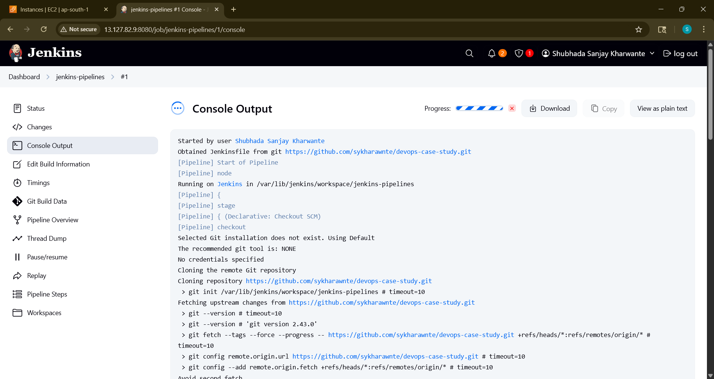

# 🚀 DevOps CI/CD Pipeline for Node.js App

This project demonstrates a *complete DevOps pipeline* that builds, tests, provisions, configures, and deploys a simple Node.js web application on *AWS Free Tier*, using tools like Git, Docker, Jenkins, Terraform, and Ansible.

🔗 *GitHub Repo URL*: [https://github.com/rahulbhatia3422/devops-nodejs-app]()

---

## 🧠 Learning Objectives

- Apply Git branching and pull request workflows on GitHub
- Containerize a Node.js app and publish to DockerHub
- Provision infrastructure using Terraform (IaaC)
- Configure VMs and deploy containers using Ansible
- Automate the complete CI/CD process using Jenkins pipelines
- Write reusable Bash scripts with error handling and logging

---

## 🛠 Tech Stack

- *Node.js* – Web Application
- *Git & GitHub* – Version Control and Collaboration
- *Docker & DockerHub* – Containerization
- *Terraform* – Infrastructure Provisioning on AWS
- *Ansible* – Configuration Management & App Deployment
- *Jenkins* – CI/CD Orchestration
- *AWS EC2 (Free Tier)* – Cloud Hosting

---

## 1️⃣ Architecture Diagram

---

# 2️⃣ Web Application UI

